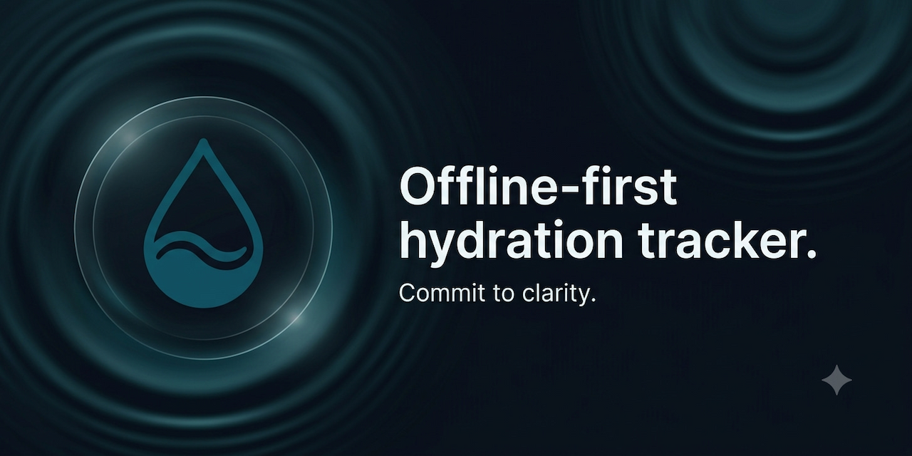

<p align="center">
  
</p>

# Water Reminder

Water Reminder is an offline-first Android hydration companion built on the Shahab Mobile Platform. It focuses on fast water logging, gentle reminders, local history/statistics, optional Health Connect hydration sync, and a responsive Android home-screen widget.

Hydration records and Health Connect data are stored locally and are never included in telemetry. Optional anonymous diagnostics can be enabled from Settings to send safe usage events and crash diagnostics to Google Firebase.

## Product Highlights

- Fast quick-add and custom hydration logging.
- Calm Home dashboard with animated water progress.
- Local reminder engine with pause and quiet-hour behavior.
- History and statistics.
- Android home-screen widget with quick actions.
- Optional Health Connect hydration read/write sync.
- Local export, import, reset, and delete controls.
- No mandatory account, ads, subscriptions, or cloud hydration backend.

## Development

Core commands:

```sh
npm run lint
npm run typecheck
npm test
npm run validate:assets
```

Development build workflow:

- [Expo Development Build](./docs/setup/DEVELOPMENT_BUILD.md)
- [Architecture](./docs/ARCHITECTURE.md)
- [Brand Asset Integration](./docs/branding/BRAND_ASSET_INTEGRATION.md)
- [Release Checklist](./docs/RELEASE_CHECKLIST.md)

## Release Notes

Publication readiness documentation lives in:

- [Production Config Audit](./docs/release/PRODUCTION_CONFIG_AUDIT.md)
- [Firebase Release Verification](./docs/release/FIREBASE_RELEASE_VERIFICATION.md)
- [Data Safety Guidance](./docs/compliance/DATA_SAFETY.md)
- [Health Connect Declaration](./docs/compliance/HEALTH_CONNECT_DECLARATION.md)
- [Play Store Listing](./docs/store/PLAY_STORE_LISTING.md)

## Repository Layout

```txt
app/                         Expo Router routes
assets/branding/             Final production brand assets
docs/                         Product, architecture, compliance, and release docs
plugins/water-reminder-widget Android widget config-plugin templates
src/                          Application source
```

## Legal

- [Privacy Policy](./docs/legal/PRIVACY_POLICY.md)
- [Terms Of Use](./docs/legal/TERMS_OF_USE.md)
- [Open Source Notices](./docs/legal/OPEN_SOURCE_NOTICES.md)
