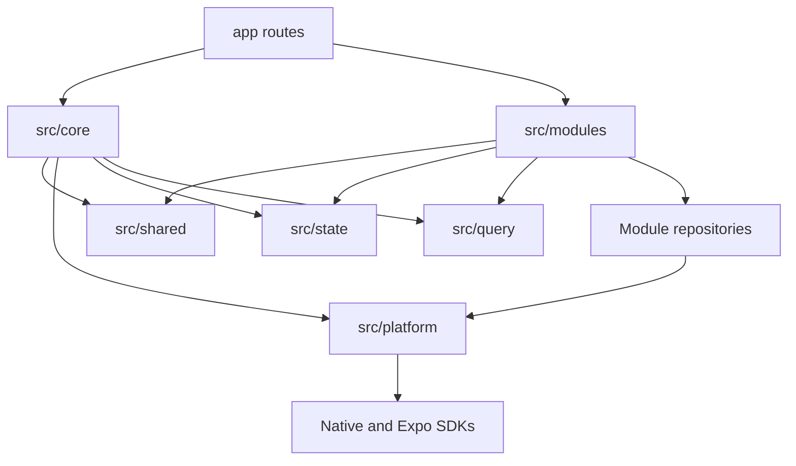

# Architecture Diagram

```mermaid
flowchart TD
  App[app routes] --> Core[src/core]
  Core --> Shared[src/shared]
  Core --> Platform[src/platform]
  Core --> State[src/state]
  Core --> Query[src/query]
  App --> Modules[src/modules]
  Modules --> Shared
  Modules --> State
  Modules --> Query
  Modules --> Repositories[Module repositories]
  Repositories --> Platform
  Platform --> SDKs[Native and Expo SDKs]
```
