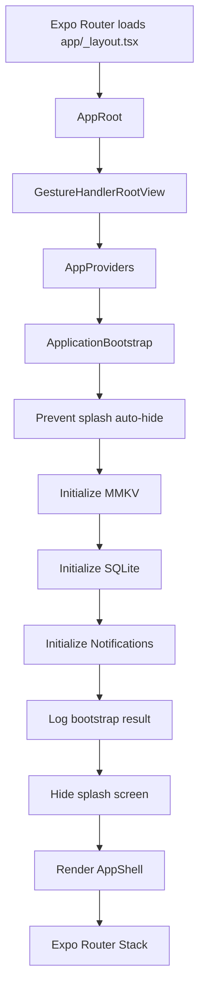

# Bootstrap Diagram

```mermaid
flowchart TD
  A[Expo Router loads app/_layout.tsx] --> B[AppRoot]
  B --> C[GestureHandlerRootView]
  C --> D[AppProviders]
  D --> E[ApplicationBootstrap]
  E --> F[Prevent splash auto-hide]
  F --> G[Initialize MMKV]
  G --> H[Initialize SQLite]
  H --> I[Initialize Notifications]
  I --> J[Log bootstrap result]
  J --> K[Hide splash screen]
  K --> L[Render AppShell]
  L --> M[Expo Router Stack]
```
