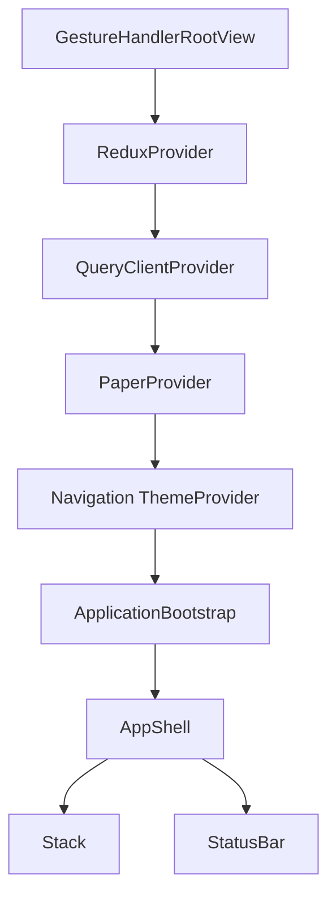

# Provider Tree Diagram

```mermaid
flowchart TD
  A[GestureHandlerRootView] --> B[ReduxProvider]
  B --> C[QueryClientProvider]
  C --> D[PaperProvider]
  D --> E[Navigation ThemeProvider]
  E --> F[ApplicationBootstrap]
  F --> G[AppShell]
  G --> H[Stack]
  G --> I[StatusBar]
```
