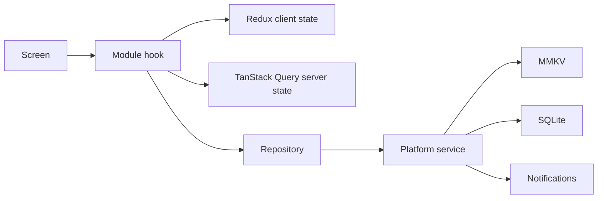

# State Flow Diagram

```mermaid
flowchart LR
  Screen[Screen] --> Hook[Module hook]
  Hook --> Redux[Redux client state]
  Hook --> Query[TanStack Query server state]
  Hook --> Repository[Repository]
  Repository --> Platform[Platform service]
  Platform --> Storage[MMKV]
  Platform --> Database[SQLite]
  Platform --> Notifications[Notifications]
```
